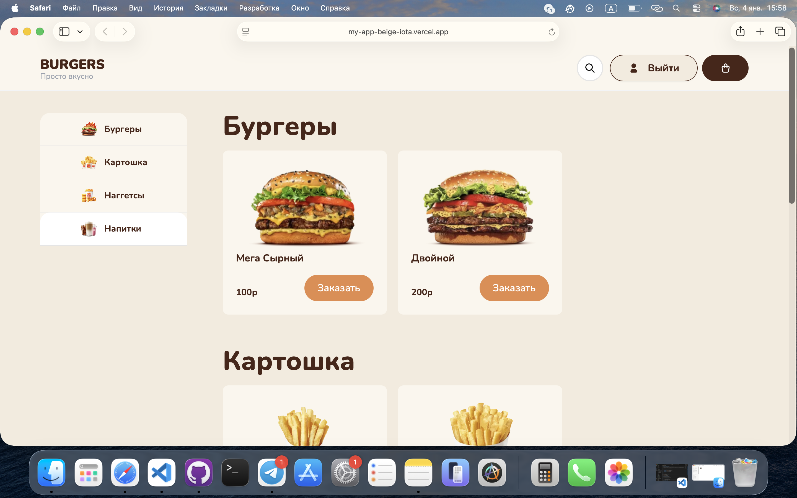
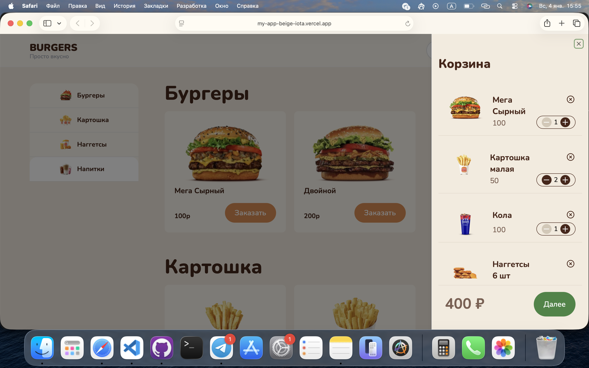
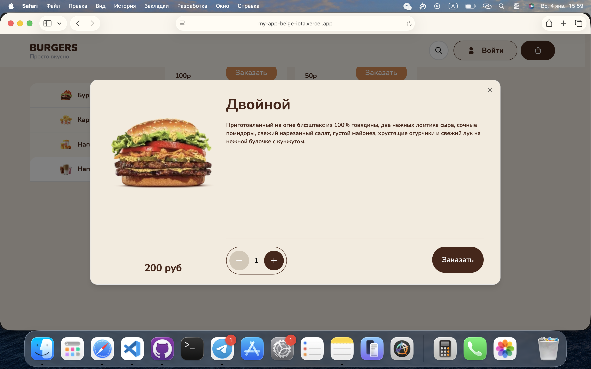
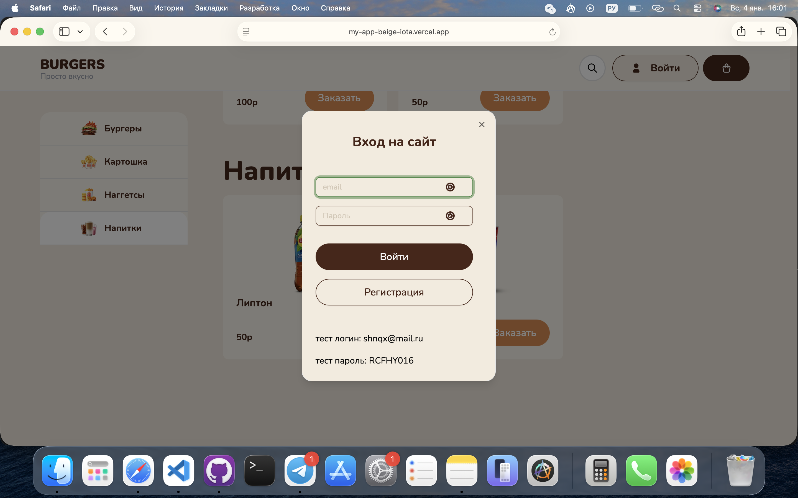

# Personal Portfolio Website

Современный сайт-портфолио, построенный на стеке Next.js для демонстрации моих навыков фронтенд-разработки, выполненных проектов и контактной информации.

## 🚀 Стек технологий

- **Фреймворк:** [Next.js](nextjs.org) (App Router)
- **БД:** [Supabase](supabase.com)
- **Стили:** [Tailwind CSS](tailwindcss.com)
- **Язык:** [TypeScript](www.typescriptlang.org)
- **Компоненты:** [Shadcn](shadcn.io)
- **Деплой :** [Vercel](vercel.com)
- **Иконки:** Lucide React / React Icons

## 🚀 Скрины






## Ссылка на гитхаб и деплой
https://github.com/shnqx/my-app
https://my-app-beige-iota.vercel.app/

## ✨ Пока что не реализовно

- Нет Dashboard

## 🛠 Установка и запуск

1. **Клонируйте репозиторий:**
```bash
git clone github.com
```
2. **Установите зависимости:**
```bash
npm install
```
или
```bash 
yarn install
```
3. **Запустите сервер для разработки:**
```bash
npm run dev
```

4. **Откройте http://localhost:3000 в браузере.**

Если у вас есть вопросы или предложения по работе, буду рад пообщаться:
Telegram: [@shipunov_nikita]
Email: [shnqx@mail.ru]